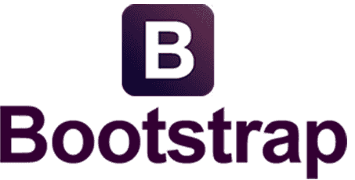

# tianh bbs

这是为华东理工大学，大学生创新创业项目（2020），制作的一个 BBS 系统模板。遵循 CC-BY-NC 4.0 协议。

## 概述

<table width=0>
<tr>
<a href="https://www.djangoproject.com/">
<td width=33.33%>

</td>
</a>
<a href="https://www.getbootstrap.com/">
<td width=33.33%>

</td>
</a>
<a href="https://www.mysql.com/">
<td>

</td>
</a>
</tr>
</table>

## 如何使用

## 文档

